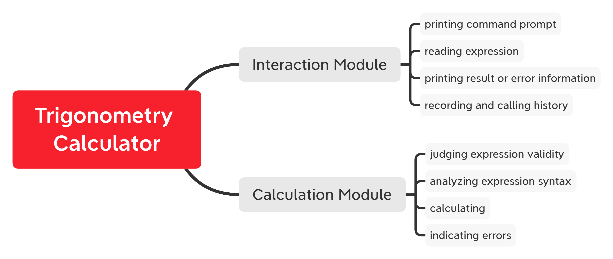
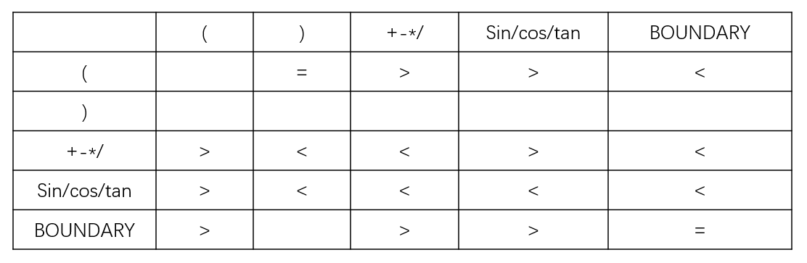

# PROJECT 3 - TRIGONOMETRY CALCULATOR

> Auther: stupidpanther 
> E-mail: stupidpanther@163.com

### Requirement Analysis

As a trigonometry calculator, it receive a user-input expression and print the result if valid. Generally speaking, it has following functions.
+ reading expression from user input
+ judging the validity of the expression
+ analyzing expression syntax and dividing it into several unary or binary expression
+ calculating
+ print the result

To improve user exprience, it ought to have following functions also.
+ indicating the errors of expression syntax visually if existing
+ recording history

### Module Design

Here is a module design of the project.


### Data Structure

We implemented classes for each of the modules.

+ `class Interaction`
``` cpp
class Interaction
{
private:
	string expression; // user-input expression
	vector<string> history; // history of user input
	vector<string> history_edit; // same as last one, except user did some changes
	unsigned int history_len; // max length of the history
	history_mode_t history_mode; // whether record unsuccessful commands 
	calmode_t mode; // using radian or degree system

public:
	Interaction();
	~Interaction();
	int Exec(); // execution function of the command line, called by main()

private:
	void ReadExpression(); // read user-input expression
	void Output(string output); // output some information after user press 'enter' key
	void PrintPrompt(); // print the command prompt
};
```

+ `class Calculation`
``` cpp
class Calculation
{
private:
	string expression; // user-input expression
	vector<word_t> operator_stack; // operator stack, used to calculate infix expression
	vector<double> operand_stack; // operand stack, used to calculate infix expression
	string error_info; // error information, provided when meeting errors
	double res; // final result of the calculation
	string output; // output of calculation module
	calmode_t mode; // using radian or degree system

public:
	Calculation(string expr, mode_t m);
	~Calculation();
	string Res(); // get final output of calculation module, called by interaction module
	void SetMode(mode_t m); // choose to use radian or degree system

private:
	vector<word_t> DivWords(string expr); // divide user-input expression into program understandable words
	void Operate(vector<word_t> word_seq); // operate final result
	void GenErrorInfo(unsigned int pos, unsigned int len, string info); // generate error information
};
```

### Core Algorithm

In general, there are several queations for us to answer: How to transfer the user-input expression to program understandable expression? How to calculate the program understandable expression? How to locate where user made syntax mistakes, if existed? How to record history?
Also, we ought to provide user a comfortable interactive environment. In other word, the program should be easy to use.

This part focuses on the contents mentioned above.

+ **From user-input expression to program understandable expression**
    This process can be divided into following sub-processes:
    + word division
		Two types of keyword may occur in user-input expression, real number and certain symbols included. For real number, only number 1 ~ 9 and no more than one dot could be included, without starting with a dot. For certain symbols, it should be able to match an entry of the symbol table of the program, case-insensitively.
    + generating pseudo postfix expression using stack structure
		The reason it is called pseudo postfix expression is that the sub-process do operating process in fact, just drawing lessons from the idea of the postfix expression. Two stacks needed here, operator stack and operand stack included. We throw a word into operator stack or operand stack or do operation using the operator at the top of the operator stack or do nothing when scanning the keywords generated from user-input expression. The following principles is followed. 
		+ If current operator has higher priority than the operator at top of the stack, push current operator into stack.
		+ If current operator has same priority than the operator at top of the stack, which means we have just processed the contents between a pair of parantheses, just pop the operator of the stack (it must be the left parentheses or boundary).
		+ If current operator has lower priority of the operator at top of the stack, do operation of the operator at the top of the stack. Whether pop two operands or one depends on whether the operator is binary or unary.
		After scanning all the keywords, there must be only one item in the operands stack, which is the final result of our calculation.
		The priority relationship of the operators is here:
		(horizon header means current operator, vertical header means the operator at the top of the stack)
		
+ **Calculating the program understandable expression**
    It should be concentrated here that differences exists between unary operator and binary operator.
    We calculate the program understandable expression by operator priority. Also, we use library functions to implement low-level operations.
+ **Syntax mistakes location**
    Record the pointer location when reading user-input expression. It indicates where the mistake is.
	There are four types of errors:
	+ invalid real number representation
	+ unreadable keyword
	+ violation of the adjacent relationship followed by operators and real numbers
	+ non-zero divisor
+ **History**
	Two type of history record mode are provided. The simple mode only record successfully executed commands while the full mode record all commands when user press enter key.

### User Manual

+ **Supported operation types**
	Addition, subtraction, multiplication, division, negative operation, sine, cosine, tangent.

+ **Representation of real numbers and constant numbers**
	Real numbers are represented in decimal, with no more than one dot not at the beginning of the number. keyword Pi means 3.1415926. (case insensitive)

+ **Priority of the operators**
	+ level 1: parenthesis
	+ level 2: negative operator and trigonometry
	+ level 3: multipilication and division
	+ level 4: addition and subtracion
	Lower level means higher priority.

+ **History**
	Two type of history record mode are provided. The simple mode only record successfully executed commands while the full mode record all commands.
	It is simple mode when program started. You can use command "history mode simple" or "history mode full" to change it.
	The max length of history is five by default. You can change it using command "history size \[integer\]" to change it.

+ **Error information**
	Error information indicates where and what type the error is when you meet it.

+ **Radian and degree system**
	It uses radian system when the program started. You can use command "deg" or "rad" to change it.

### Special Thanks
+ Analyzing expression using stack:
[https://leetcode-cn.com/problems/basic-calculator/solution/qiao-yong-yun-suan-fu-you-xian-ji-biao-he-zhan-shi/](https://leetcode-cn.com/problems/basic-calculator/solution/qiao-yong-yun-suan-fu-you-xian-ji-biao-he-zhan-shi/)
+ Infix expression and postfix expression:
[https://zhuanlan.zhihu.com/p/123315675](https://zhuanlan.zhihu.com/p/123315675)
+ Color control in terminal
[https://blog.csdn.net/RadiantJeral/article/details/105456642](https://blog.csdn.net/RadiantJeral/article/details/105456642)
+ Implement a customized shell using C language
[https://blog.csdn.net/aiwangtingyun/article/details/79636990](https://blog.csdn.net/aiwangtingyun/article/details/79636990)
+ VT 100 control code
[https://blog.csdn.net/liufei191010/article/details/81015445](https://blog.csdn.net/liufei191010/article/details/81015445)
+ Implementation of getch() in Linux
[https://zhuanlan.zhihu.com/p/32494610](https://zhuanlan.zhihu.com/p/32494610)
